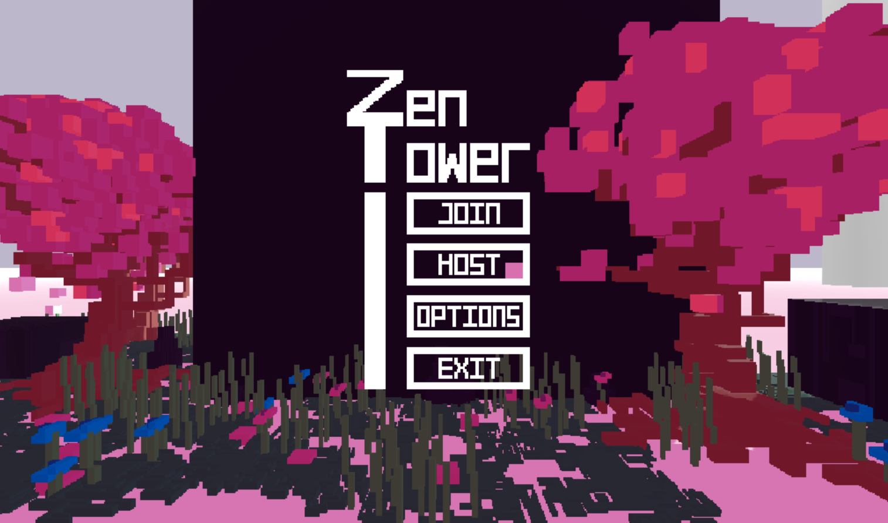
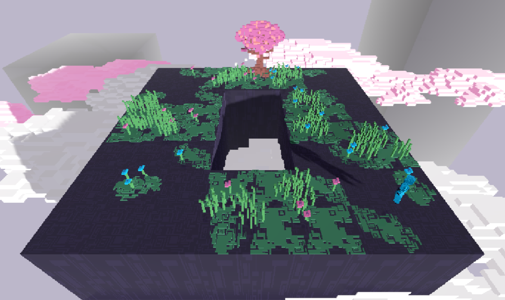
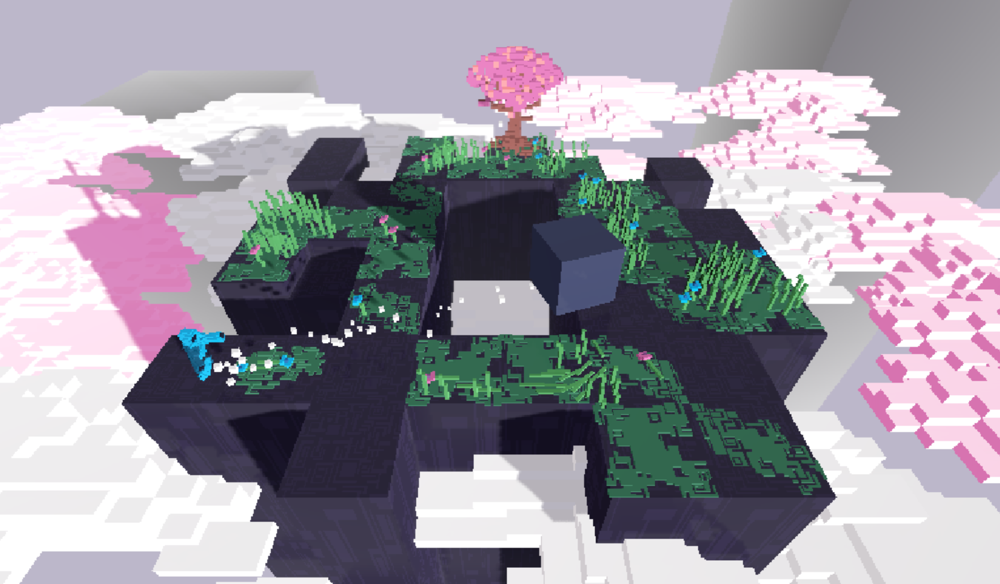

# Zen Tower

A competitive multiplayer brawler where the only objective is to be the last one standing, the King of Zen Tower!

Default controls:

- WASD to move

- E to summon a rock

- left mouse button to push

- right mouse button to pull

Notes:

  - Did not realize this when uploading but you need Godot installed to play it!

   - To play you must make sure you use a public ipv4 address and the port "10567" is forwarded

   - Enjoy!

Language: GDScript

## Screenshots

